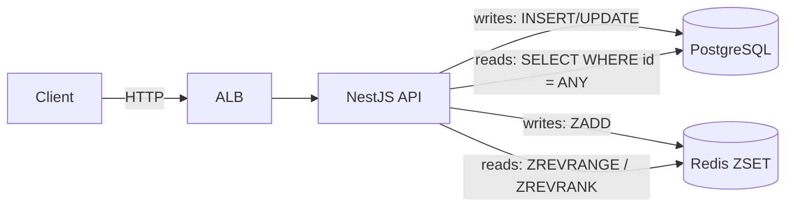
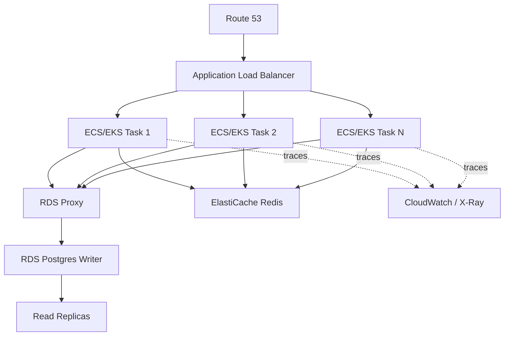

# Design Document — User Leaderboard System

## Overview

- **PostgreSQL** is the authoritative source of truth for all user data (ACID, durability, profiles).
- **Redis Sorted Set (ZSET)** is the serving index for all ranking operations (O(log N) rank, top-N, neighbors).
- Every write updates Postgres first, then Redis. Every read fetches rankings from Redis and hydrates profiles from Postgres.
- Deterministic ordering: **score DESC, id ASC**, enforced via inverted zero-padded user IDs as ZSET members.

## Runtime Flow



**Write path:** Postgres is updated (with pessimistic lock), then Redis ZADD reflects the new score. Top-N payload cache keys are invalidated.

**Read path:** Redis returns ranked user IDs + scores. Postgres hydrates profiles in a single batch query. Results are merged in ZSET order.

## Data Structure Design — Redis ZSET

### Why Redis ZSET

A Redis Sorted Set is backed by a **skip list with span counters**, enabling O(log N) rank lookups by summing spans during traversal — no element counting required. This is the key difference from PostgreSQL, where rank requires scanning index entries.

### Operations and Complexity

| Operation | Redis Command | Complexity |
|-----------|--------------|------------|
| Add / update score | `ZADD` | O(log N) |
| Get rank | `ZREVRANK` | O(log N) |
| Top N | `ZREVRANGE 0 N-1 WITHSCORES` | O(log N + N) |
| Neighbors (K) | `ZREVRANGE rank-K rank+K WITHSCORES` | O(log N + K) |
| Total count | `ZCARD` | O(1) |
| Remove user | `ZREM` | O(log N) |

**Memory estimate:** ~80 bytes per entry × 10M users ≈ 800 MB — fits in a single ElastiCache node.

### Deterministic Tie-Breaking

Redis `ZREVRANGE` returns equal-score members in **descending lexicographic** order. To achieve **id ASC** tie-breaking, user IDs are inverted and zero-padded to 20 digits:

```
MAX = 99999999999999999999
member = pad(MAX - userId, 20)
```

| userId | ZSET Member | Score |
|--------|-------------|-------|
| 1 | `99999999999999999998` | 1000 |
| 2 | `99999999999999999997` | 1000 |

`ZREVRANGE` returns `...9998` before `...9997` → userId 1 before userId 2. ✓ score DESC, id ASC.

### Invariant, Self-Heal, and Rebuild

**Invariant:** Every user in PostgreSQL must exist in the Redis ZSET (including users with score 0).

- **On write:** Every `POST /users` and `PATCH /users/:id/score` performs `ZADD` after the Postgres write. If Redis fails, the error is logged and the user is still persisted.
- **Self-heal on read:** `GET /leaderboard/user/:id` checks `ZREVRANK`. If the user is missing from the ZSET, the service re-adds them via `ZADD` using their Postgres score, then retries.
- **Full rebuild:** `npm run redis:rebuild` scans all users from Postgres (keyset pagination, batches of 10K) and bulk-ZADDs into Redis via pipelines. ~2–5 minutes for 10M users.

## Why Not PostgreSQL COUNT(\*) for Rank

```sql
SELECT COUNT(*) + 1 FROM users WHERE score > $1 OR (score = $1 AND id < $2);
```

The B-tree seek is O(log N), but `COUNT(*)` must **traverse every matching index entry**. True complexity: **O(log N + R)** where R is the number of rows ahead of the user — up to N. For a user at position 5M out of 10M, PostgreSQL scans 5M index entries. Redis `ZREVRANK` does this in O(log N) ≈ 24 operations via skip list span counters.

## Database Schema

### Table and Indexes

```sql
CREATE TABLE "users" (
  "id"         BIGSERIAL       PRIMARY KEY,
  "name"       VARCHAR(255)    NOT NULL,
  "image_url"  VARCHAR(1024),
  "score"      BIGINT          NOT NULL DEFAULT 0,
  "created_at" TIMESTAMPTZ     NOT NULL DEFAULT NOW(),
  "updated_at" TIMESTAMPTZ     NOT NULL DEFAULT NOW()
);

CREATE INDEX "idx_users_score_id" ON "users" ("score" DESC, "id" ASC);
CREATE INDEX "idx_users_score_nonzero" ON "users" ("score" DESC, "id" ASC) WHERE "score" > 0;
```

### How the Schema Supports Efficient Leaderboard Operations

- **Profile hydration** — `SELECT id, name, image_url, score FROM users WHERE id = ANY($1)` hits the PK index. O(K × log N) for K users. No joins, no sorting.
- **Score updates** — Single-row PK update with pessimistic lock: `SELECT ... FOR UPDATE` then `save()`. O(log N) index lookup.
- **Composite index `(score DESC, id ASC)`** — Used by the rebuild script for ordered extraction, fallback SQL ranking if Redis is unavailable, and consistency auditing against the ZSET.
- **Partial index `(score > 0)`** — Excludes inactive users (score 0). If 70% of 10M users never scored, this index is 70% smaller and faster for any fallback queries.
- **BIGSERIAL PK** — Auto-incrementing 64-bit ID supports well beyond 10M users and maps directly to the ZSET member encoding.

## API Endpoints

| Method | Endpoint | Postgres | Redis |
|--------|----------|----------|-------|
| `POST /users` | INSERT user → returns id | ZADD score paddedId + invalidate cache |
| `PATCH /users/:id/score` | UPDATE with pessimistic lock | ZADD new score + invalidate cache |
| `GET /leaderboard/top?limit=N` | SELECT profiles by IDs | ZREVRANGE 0 N-1 WITHSCORES |
| `GET /leaderboard/user/:id` | SELECT user + neighbor profiles | ZREVRANK + ZREVRANGE rank±5 |
| `GET /health` | DB ping | Redis ping |

- Limit is clamped to \[1, 1000\] with default 100. Response includes `{ limitRequested, limitApplied, total }`.
- Top-N responses are payload-cached in Redis (`leaderboard:top:{limit}`, TTL configurable). Cache is invalidated on every score write.
- User rank response returns `{ position, user, neighbors: { above: [...], below: [...] } }`.

## AWS Cloud Architecture



- **Route 53** — DNS routing with health checks and regional failover.
- **ALB** — HTTPS termination, request routing to healthy ECS/EKS tasks.
- **ECS/EKS** — Stateless NestJS containers, auto-scaled on CPU (target 60%) or request count. Minimum 2 tasks.
- **RDS Proxy** — Connection pooling. Prevents container scale-out from exhausting Postgres connection limits.
- **RDS PostgreSQL** — Multi-AZ writer with automated failover. Daily snapshots + PITR. Read replicas offload profile hydration queries.
- **ElastiCache Redis** — ZSET serving index. Multi-AZ with auto-failover. If data is lost, rebuilt from Postgres in ~5 minutes.
- **CloudWatch / X-Ray** — Metrics, alarms, distributed tracing. NestJS correlation IDs propagated through requests.

| Tier | Users | Strategy |
|------|-------|----------|
| < 1M | 1 RDS + 1 Redis + 2 API tasks | Default |
| 1–10M | + 1 read replica + RDS Proxy + 4 API tasks | Connection pooling, read offload |
| 10–100M | + Multi-AZ + 2 read replicas + HPA | Auto-scaling, Redis cluster mode |
| 100M+ | Shard by game/region, multiple ZSETs | Per-game/regional leaderboards |
